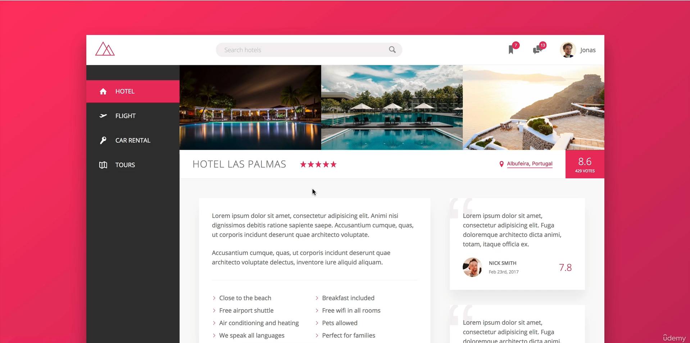

# Trillo - booking app 

***

⚠️<b>This project is from advanced css course</b>⚠️

👁️ [Project overview](https://www.udemy.com/course/advanced-css-and-sass/learn/lecture/8274584#overview)

⭐ [Author GitHub repo](https://github.com/jonasschmedtmann/advanced-css-course)

***

📚 BEM methodology, flexbox, responsive web design, animations, css tricks, etc.

